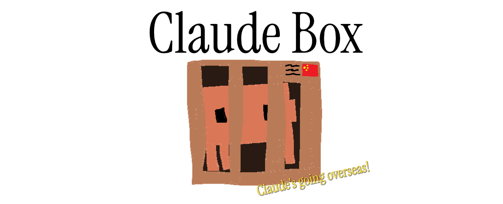

# claude-box [](https://github.com/movecx/claude-box/actions/workflows/release.yml)



A sandbox manager for Claude Code. Run multiple isolated Claude Code instances with separate configurations, credentials, and conversation history.

## Features

- **Isolated Environments** - Each environment has its own config directory, API keys, and history
- **Visual Distinction** - Configurable colored borders help identify which environment you're in
- **Provider Support** - Use Anthropic directly or configure alternative providers (Z.ai, Minimax, custom anthropic endpoints)
- **Cross-Platform** - Works on Windows, macOS, and Linux

## Installation

### Quick Install

**macOS / Linux:**
```bash
curl -sSfL https://raw.githubusercontent.com/movecx/claude-box/master/install.sh | sh
```

**Windows (PowerShell):**
```powershell
irm https://raw.githubusercontent.com/movecx/claude-box/master/install.ps1 | iex
```

### From Source

```bash
cargo install claude-box
```

## Requirements

- [Claude Code](https://github.com/anthropics/claude-code) must be installed and available in PATH

## Usage

```bash
# Open default environment
claude-box

# Open a specific environment
claude-box work

# Configure environments
claude-box config
```

### Configuration TUI

Run `claude-box config` to open the configuration interface where you can:

- Create new environments
- Set border colors and names
- Configure API providers
- Set a default environment
- Delete environments

## How It Works

claude-box sets the `CLAUDE_CONFIG_DIR` environment variable to redirect Claude Code's configuration to an isolated directory per environment. Each environment maintains its own:

- API credentials
- Conversation history
- Settings and preferences
- Project memory

## Data Locations

| Platform | Config | Environment Data |
|----------|--------|------------------|
| Linux | `~/.config/claude-box/` | `~/.local/share/claude-box/environments/` |
| macOS | `~/Library/Application Support/claude-box/` | `~/Library/Application Support/claude-box/environments/` |
| Windows | `%APPDATA%\claude-box\` | `%LOCALAPPDATA%\claude-box\environments\` |
